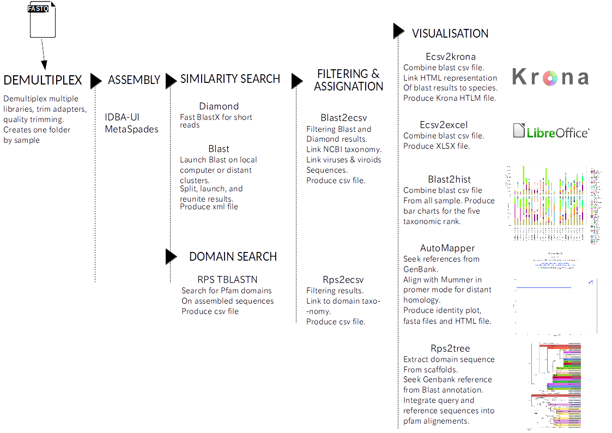

# VirAnnot

VirAnnot was build to ease the assembly, blast search and taxonomic annotation of metagenomic NGS data. It is used in Virologie team of [UMR1332 BFP](http://www6.bordeaux-aquitaine.inra.fr/bfp) laboratory at INRA.
VirAnnot also takes part of the Euphresco project "[Plant Health Bioinformatics Network](https://doi.org/10.5281/zenodo.3245830)". See [more](https://gitlab.com/ahaegeman/phbn-wp2-training).

It is designed to identify viruses in plant metagenomic data but it can be used to assemble and annotate any sequences with the NCBI taxonomy.

See documentation:
https://virannot-docs.readthedocs.io/en/latest/

Pipeline general scheme:

